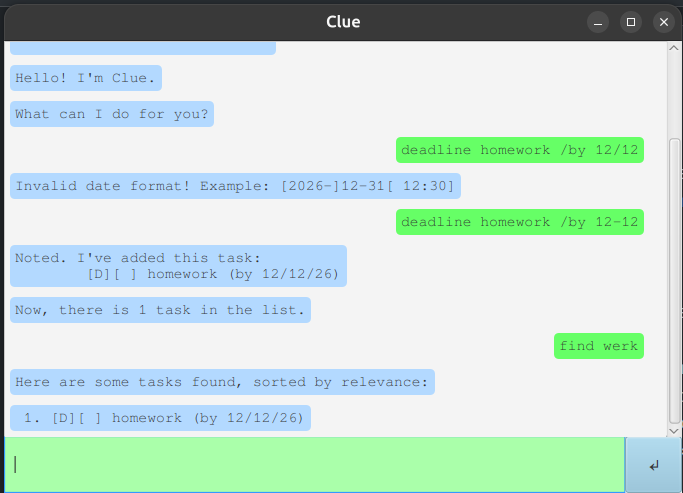

# Clue User Guide

// Product screenshot goes here

// Product intro goes here
**Clue** is a chatbot with robust task recording features. 
Your tasks are persisted to disk, and can range from todos, deadlines, to events.

## Adding todos, deadlines, and events

`todo <name>`

Creates a ToDo with the given name

`deadline <name> /by <datetime>`

Creates a Deadline with the given name, to be done by the given time.
Datetimes are in  \[YY-]MM-DD\[ HH:mm] format, where square brackets denote optional parts.

`event <name> /from <datetime> /to <datetime>`

Creates an Event with the given name that lasts in a range.
Datetimes are in \[YY-]MM-DD\[ HH:mm] format, where square brackets denote optional parts.

## Fuzzy Search
`find <term>`
Looks for instances of `<term>` in task names. Includes task names that may not match the given term exactly e.g. 1 or 2 letters off.
Tasks that match the term more exactly are listed first.

